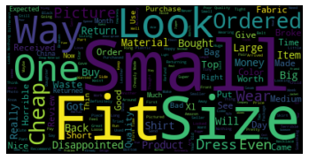
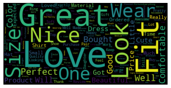
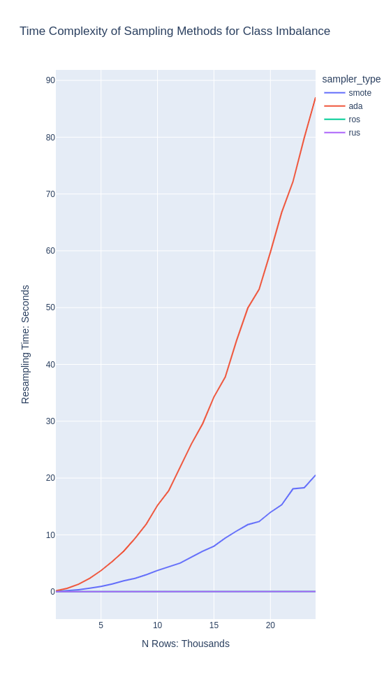

# Sentiment Analysis of Amazon Fashion Review Dataset

## Business Case
---
**Natural Language Processing** and **sentiment analysis** have become an important business tool. Negative coverage online can have wide-reaching and long-lasting effects. Companies have started tracking indirect customer feedback to get ahead of bad publicity. It would be unfeasible to have employees read every single tweet or online post, so machine learning approaches have become popular.

[62% of Customers will recommend a brand with great service
45% will stop buying after two bad experiences](https://site.gladly.com/rs/665-VXG-269/images/2021%20Customer%20Expectation%20Report.pdf?mkt_tok=NjY1LVZYRy0yNjkAAAGAxH87EvX9rxPsw9GOdnlHgxiK6Qz2IkFJcKL96lOrLF5neOfRcSypy0WA2IZSUACOYgaxo9L79oiITF-qdgffQ6P6ONAMtIwwAv_YGwU)

## Overview
---
In this project, we are examining over **800,000** reviews from Amazon in the *Fashion* category (clothes, jewelry, shoes, etc). We'll build an NLP classifier that will use the text of the review to predict whether it was positive or negative (splitting 1-3 as negative and 4-5 as positive). Using **supervised learning classification** models, we'll try to accurately predict the negative reviews, as these are both more rare, and can have a higher business impact. We will deal with some **Big Data** issues, such as sampling methods for quicker training/inference, and choosing a model for big data applications.

## Data Source:

[Jianmo Ni, Jiacheng Li, Julian McAuley
Empirical Methods in Natural Language Processing (EMNLP), 2019](https://nijianmo.github.io/amazon/index.html)

## Data Acquisition and Wrangling:
The data was available as a gzipped json file. Reading the json file, we removed columns which were not relevant to the analysis. Primary columns we kept included reviews, summaries, and stars given by the user. We dropped a number of columns about the item style, image link, time of review and general user data. Out of our entire dataset, we had zero reviews with a missing star count. We discovered 1233 of the total 883,636 reviews (roughly 0.13 percent of the total data) with no text. We did not drop the data with missing review text in order to explore them later.

## Exploratory Data Analysis

In the [EDA](/notebooks/02_Exploratory_Data_Analysis.ipynb) we looked at relationships between the different features. We have **imbalanced data** with significantly more positive reviews than negative ones (~70/30 split). We have coded the 1-3 star reviews as negative (1) and the 4-5 star reviews as positive (0) in order to build a binary classification model where our target class is the negative reviews. There did not appear to be a relationship between not having review text and the number of stars. We **dropped 1736 rows with missing data/nulls**. We also cleaned the data of contractions and non-letter characters before also removing low-meaning stop words (ie. "a", "and", "the"). We did remove some numbers such as if a review was only a "5". While numbers may have been useful for this model, they would not necessarily be generalizable to other areas (a tweet with a "5" probably doesn't mean a very positive tweet!).

   

## Preprocessing and Training Initial models

In the [Preprocessing and Training](/notebooks/03_Preprocessing_and_Training.ipynb) we converted our text to numbers (vectors) using two methods. Machine learning models need numeric input for prediction. We tried both Count Vectorization aka [Count-Vec](https://scikit-learn.org/stable/modules/generated/sklearn.feature_extraction.text.CountVectorizer.html) and Term-Frequency Inverse-Document Frequency aka [TF-IDF](https://scikit-learn.org/stable/modules/generated/sklearn.feature_extraction.text.TfidfVectorizer.html). 

Count Vec uses simple word counts to generate a matrix of vocabulary proportions. Our TF-IDF used both unigrams and bi-grams and removed the most common words that appeared in 90+ percent of review texts. The Count Vec vocab size was about 75279 features (columns) while the TF-IDF vectorization produced 2,310,780(!) features/columns.

The first approaches used **Logistic Regression**, **Naive Bayes** and **Random Forest** for simple initial models. Because we are trying to correctly predict the negative reviews (coded as 1), our primary metric is recall for the positive class.

${Recall} = \frac{{True \ Positive}} {({True \ Positive}+{False \ Negative})}$

The best initial model with minimal tuning was the Logistic Regression with TFIDF. The recall on the test set approached 85% while the other models had <80% recall on the test set. 

## Modeling

In the [Modeling](/notebooks/04_Modeling.ipynb) we used only TFIDF, despite the much larger matrix with 2+ million features. The increased info for the model using bigrams (the difference between "bad fit" vs "good fit" for instance) gave better metrics across all models.

Because of the imbalance of the data, we test out a set of options for under/over-sampling to improve model performance. Random-undersampling of the majority class, over-sampling of the minority class, as well as synthetic data generation with SMOTE and ADASYN.

The time complexity of SMOTE and ADASYN is roughly O(n^2) due to using KNN to create synthetic values. This was very, very slow on even small-to-medium training sets. It also did not improve the model recall. ADASYN is slightly slower than SMOTE due to also adding random noise to the new values.

The three final algorithms we use for prediction are Logistic Regression (the best "simple" model from the previous notebook), as well as two tree-based classification models, LightGBMClassifier and XGBoostClassifier.

To optimize hyper-parameters, we implement a custom Optuna fuction which uses bayesian search across a range of chosen parameters. For quicker iteration, we use a small, random subset of the training data for training and evaluate models using recall on a held-out test set.

## Analysis and Summary

In summary, the logistic regression model performs the best on a number of metrics. It is the fastest to train by far, especially as the size of the data increases. Because we have a binary (positive or negative) classification problem, the decision boundary or hyperplane is linear. Logistic regression is perfect for this type of problem. It computes very quickly and gives feature weights (coefficients) for easy interperability.

|Model|Recall|Train/Predict Time on ~150K Rows|
|-----|-----|-----|
|Logistic Regression|.91|2 seconds|
|XGBoost|.84|5 minutes and 30 seconds|
|LightGBM|.84|1 minute|

XGBoost and LightGBM models may have better metrics on multiclass problems, but were less effective here.

